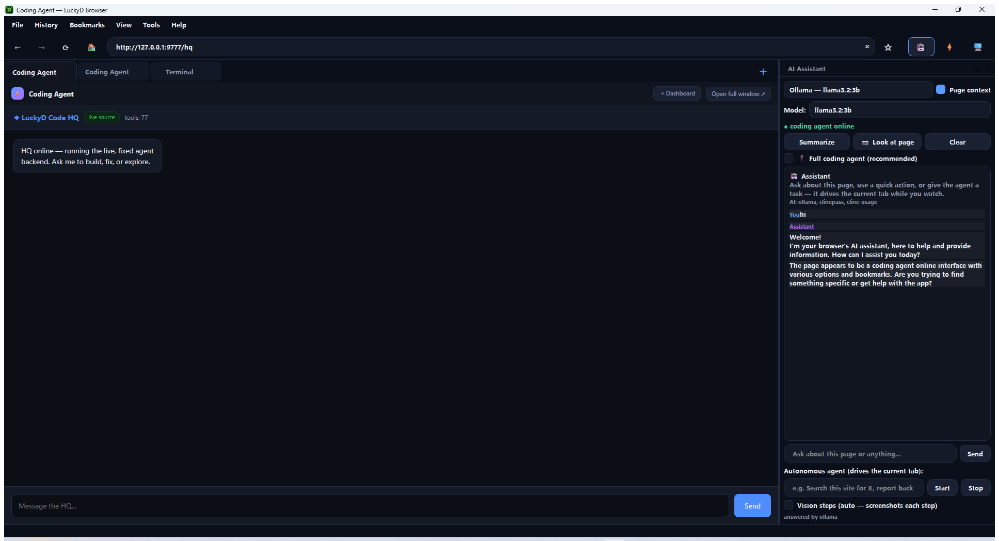

# LuckyD Browser

**A Chromium-based AI browser for Windows — with a free, unlimited, offline AI assistant built in.**
No accounts. No API keys. No subscriptions. The installer sets everything up for you.

[](LICENSE)
[](https://github.com/Dylanchess0320/LuckyD-Browser/releases)
[](https://www.qt.io/)
[](#ai-providers)

LuckyD Browser is more than a browser — it's a **one-window AI platform**:

> **Web browser + AI assistant + coding agent HQ + full developer terminal — all in a single window, all able to drive your real tabs.**

<p align="center">
  <br>
  <em>The AI sidebar answering on a 100% local model — no key, no login, no cost.</em>
</p>

---

## 🥊 Why people switch

| | **LuckyD** | Comet | Dia | Edge + Copilot | Chrome + Gemini |
|---|---|---|---|---|---|
| Free AI **with no account/key** | ✅ unlimited, local | ❌ | ❌ | ❌ | ❌ |
| **Local models** (Ollama built in) | ✅ | ❌ | ❌ | ❌ | ❌ |
| Works **fully offline** | ✅ | ❌ | ❌ | ❌ | ❌ |
| Autonomous agent drives your tabs | ✅ | ✅ | ✅ | limited | limited |
| **Coding agent + terminal in a tab** | ✅ | ❌ | ❌ | ❌ | ❌ |
| Open source | ✅ MIT | ❌ | ❌ | ❌ | ❌ |
| No admin rights to install | ✅ | ✅ | ✅ | ✅ | ✅ |

The others rent you their AI. **LuckyD runs yours.**

---

## ✨ Headline: free AI, out of the box

Most "AI browsers" need an API key, an account, or a subscription before the assistant says a word.
LuckyD doesn't:

1. Run the installer.
2. Leave **"Set up free unlimited local AI"** checked (default).
3. Open the sidebar and chat — that's it.

The setup automatically installs **[Ollama](https://ollama.com)** (per-user, no admin) and pulls a fast,
tool-capable local model (`llama3.2:3b`, ~2 GB one-time download). From then on the assistant runs
**100% locally** — unlimited, offline, and private. Your prompts never leave your machine.

Prefer a cloud model instead? The sidebar supports 9 more providers — see
[AI Providers](#ai-providers). Your own keys, your choice.

---

## 📦 Download & install

**[⬇ Download the latest installer](https://github.com/Dylanchess0320/LuckyD-Browser/releases)** (`LuckyDBrowserSetup-1.6.0.exe`)

- Windows 10/11 x64 · per-user install · **no admin rights needed**
- Installs to `%LOCALAPPDATA%\Programs\LuckyDBrowser`
- Start Menu shortcut, optional desktop icon, **Settings > Apps** uninstall entry
- Everything is bundled (Chromium runtime + coding-agent backend) — nothing else required
- Silent install for scripting: `LuckyDBrowserSetup-1.6.0.exe /VERYSILENT /NORESTART`

---

## 🖥 The one-window platform

| Surface | What it is | Open it |
|---|---|---|
| **AI Sidebar** | Chat (Markdown bubbles), per-provider model picker, page-aware Q&A, 📷 visual Q&A, and an **autonomous agent that drives your real tab** — orange highlight ring, step narration, Stop button | `Ctrl+Shift+A` |
| **Coding Agent HQ** | The full `luckyd-code` workspace as a browser tab: 70+ tools, memory graph, sessions, orchestration, background tasks — auto-starts with the browser | ⚡ button or `Ctrl+Shift+H` |
| **In-browser Terminal** | Real terminals on Windows ConPTY via xterm.js — the `luckyd-code` agent CLI **and** plain PowerShell/CMD, each tab its own independent session | `Ctrl+`` ` / `Ctrl+Shift+`` ` |
| **Workflows** | Record Control-API actions into named automations and replay them with self-healing element matching | Tools → Workflows… |
| **Live Dashboard** | New-tab hub: status pills, **Ask LuckyD** box, one-tap tiles, speed dial, time-aware greetings | New tab |

**Harness mode (default ON):** sidebar agent tasks run on the coding-agent backend, which can drive
your **live, visible tabs** through the Control API — exe brain, browser hands.

<p align="center">
  <br>
  <em>The coding-agent HQ lives in a browser tab — 70+ tools, mirroring the sidebar's provider.</em>
</p>

---

## 🌐 It's also just a really good browser

**Session restore** (continue where you left off — windows, tabs, pinned state) · **tab groups**
(colors, collapse, restored with your session) with an **AI organizer** that sorts them for you ·
**Reader Mode** · tabs (pin, drag, hover previews, recently-closed) · omnibox with history completion · bookmarks (import/export
Chrome/Edge HTML) with a **toggleable bookmarks bar** (`Ctrl+Shift+B`) · searchable history ·
downloads dock with cancel · **incognito (🕶 badge, nothing touches disk)** · in-page find ·
built-in **ad/tracker blocker** · **per-site zoom memory** with Ctrl+scroll zoom · **one-key
page screenshots** (`Ctrl+Shift+S`) · **multi-terminal tabs** (agent CLI + PowerShell/CMD,
`Ctrl+`` / `Ctrl+Shift+``) · **workflow record & replay** with self-healing element matching ·
**AI data extraction to JSON** · print / save-page · view-source + DevTools · HTTPS lock icon ·
auto-retry on network errors · 4 futuristic themes with glass toasts · command palette (`Ctrl+K`) ·
AI right-click actions (**Explain / Summarize / Translate**) · **Copy as Markdown** ·
mouse back/forward buttons · full keyboard-shortcut reference (`Ctrl+/`).

---

## 🤖 AI providers

The assistant auto-detects providers at launch, in this priority order:

| Priority | Provider | Key needed? | Notes |
|---|---|---|---|
| 1 — **Local** | **Ollama** | ❌ | Free, unlimited, offline — **auto-installed by setup** |
| 1 — Local | LM Studio | ❌ | Auto-detected on `127.0.0.1:1234` |
| 2 | Cline free tier | Cline login | Free-tier models, rate-limited |
| 3 | ClinePass | Cline login | Flat-subscription gateway |
| 3 | Google Gemini | ✔ | Free tier available |
| 3 | Groq | ✔ | Free tier available |
| 3 | Z.ai / OpenRouter | ✔ | |
| 3 | DeepSeek / OpenAI / Anthropic | ✔ | |

- The **model picker** lists whatever your providers actually have installed/available.
- **Vision is automatic**: screenshots stream to the model when it supports images
  (gemma3, gpt-4o, Gemini, Claude…) and are skipped for text-only models.
- HQ and the terminal **mirror the sidebar's provider** — switch once, everywhere follows.

---

## 🧩 Architecture

```
┌──────────────────────────── LuckyD Browser (PySide6 / Qt WebEngine) ───────────────────────────┐
│                                                                                                │
│   Tabs (Chromium)      AI Sidebar ──────────┐      Dashboard / HQ shell / Terminal tab         │
│        │                                  │              (served by Control API)               │
│        │ CDP                              │                                                    │
│        ▼                                  ▼                                                    │
│   Browser Control API (127.0.0.1:9777)   AI Bridge ──► Ollama (local, keyless)                 │
│   /status /tabs /snapshot /act …         multi-provider ──► Cline / Gemini / Groq / DeepSeek … │
│        ▲                                  │                                                    │
│        │ drives live tabs                 │ mirrors provider                                   │
│   luckyd-code backend (port 8000) ◄───────┘      In-browser terminal (ConPTY ↔ WebSocket,      │
│   70+ tools · memory · orchestration             port 9881 — full luckyd-code CLI)             │
└────────────────────────────────────────────────────────────────────────────────────────────────┘
```

### Browser Control API

Localhost HTTP control of the real browser — used by the HQ agent, the terminal agent, and your
own scripts. **Binds to `127.0.0.1` only**; optional `Authorization: Bearer` token; toggle in
**Tools → Browser Control API**.

```
GET  /status /tabs /screenshot /help     POST /navigate /tab/new /act /snapshot /eval /ask
```

Element indices in `/snapshot` and `/act` are the same ones the sidebar agent uses — anything
that can read a snapshot can drive the page.

---

## 🛠 Build from source

Requirements: Windows 10/11 x64, Python 3.10–3.12, and (only for the installer) Inno Setup 6.

```powershell
git clone https://github.com/Dylanchess0320/LuckyD-Browser.git
cd LuckyD-Browser
pip install -r browser\requirements.txt

# Run from source
browser\run_browser.bat

# Build the app bundle (PyInstaller -> browser\dist\LuckyDBrowser)
cd browser
python -m PyInstaller --noconfirm --clean LuckyDBrowser.spec
cd ..

# Build the shareable installer (Inno Setup -> browser\installer\output\)
powershell -NoProfile -ExecutionPolicy Bypass -File browser\installer\build_installer.ps1
```

The installer script (`browser\installer\LuckyDBrowser.iss`) and the AI bootstrap
(`browser\installer\ollama_setup.ps1`) are plain text — tweak away.

---

## ⚙ Configuration

- **Settings UI**: search engine, homepage, ad blocker, download folder, zoom, themes
  (4 + a secret Synthwave one), startup/session restore, harness auto-start, Control
  API port/token.
- **Data folder**: `%LOCALAPPDATA%\LuckyDBrowser` (settings, history/bookmarks DB, userscripts).
- **Provider keys** (optional): set `DEEPSEEK_API_KEY`, `OPENAI_API_KEY`, `GOOGLE_API_KEY`, …
  in a `.env` next to the app, or just use the sidebar picker. No keys = local Ollama.
- **Local model**: the bootstrap installs `llama3.2:3b` (fastest tool-capable model for CPU).
  Pull others any time, e.g. `ollama pull gemma3:4b` (adds vision) or `ollama pull qwen3:8b`
  (better quality on GPU machines) — the picker finds them automatically.

---

## 🔒 Privacy & security

- **Local-first AI**: with Ollama, prompts and page content never leave your machine.
- **No accounts, no telemetry accounts, no sign-in** to use the assistant.
- All control surfaces (Control API `9777`, HQ `8000`, terminal `9881`, CDP `9222`)
  bind to **loopback only**.
- Browsing data stays in `%LOCALAPPDATA%\LuckyDBrowser`; incognito writes nothing to disk.
- The shipped bundle contains **no API keys** — cloud providers activate only with *your* keys.

## 🧹 Uninstall

**Settings > Apps > LuckyD Browser** (or `uninstall.ps1` in the install folder).
Browsing data is kept in `%LOCALAPPDATA%\LuckyDBrowser` — delete it manually for a full wipe.
Ollama is a separate product and is left installed (remove via Settings > Apps > Ollama).

---

## 🧱 Tech stack

**PySide6 / Qt WebEngine** (Chromium) · Python 3.10+ · httpx (multi-provider AI bridge) ·
Chrome DevTools Protocol · pywinpty + WebSockets + xterm.js (terminal) · PyInstaller · Inno Setup ·
Ollama (local models)

## 📄 License

MIT © 2026 [DylanChess03](https://github.com/Dylanchess0320) — see [LICENSE](LICENSE).

---

*If LuckyD Browser saves you an API bill, a ⭐ on the repo is appreciated.*

