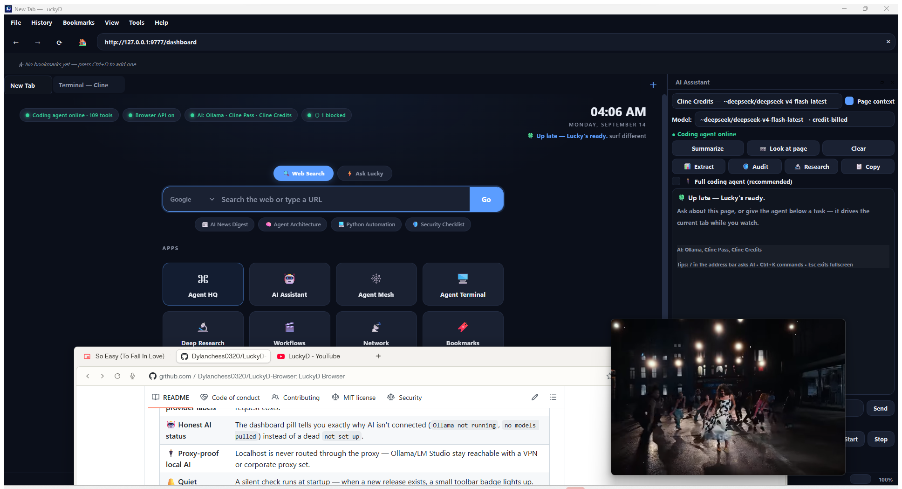

<div align="center">

# 🌐 LuckyD Browser v2.5.10 — Hardened

> **The AI browser that doesn't break. Free, unlimited, offline AI + a full coding platform in one window.**
>
> Agent Mesh. Self-healing workflows. 70+ code tools. Real ConPTY terminals.  
> All private, all loopback-only, all in one window.

[](https://github.com/Dylanchess0320/LuckyD-Browser/actions/workflows/ci.yml)
[](https://www.python.org/downloads/)
[](https://github.com/Dylanchess0320/LuckyD-Browser/releases/tag/v2.5.10)
[](LICENSE)
[](https://github.com/Dylanchess0320/LuckyD-Browser/releases)



---

**[⬇️ Download v2.5.10](https://github.com/Dylanchess0320/LuckyD-Browser/releases/tag/v2.5.10)** · **[Browser Guide](README-LuckyD-Browser.md)** · **[What's New](#-whats-new-in-2510)** · **[Changelog](CHANGELOG.md)** · **[Security](SECURITY.md)**

</div>

---

## 🎥 Showcase — Watch LuckyD in Action

> **See LuckyD Browser in action — workflows, Agent Mesh, extraction & daily browsing in one window.**

[](https://www.youtube.com/watch?v=La6bxaa7icY)

**[▶️ Watch on YouTube — https://www.youtube.com/watch?v=La6bxaa7icY](https://www.youtube.com/watch?v=La6bxaa7icY)**

---

## Why LuckyD

| | **LuckyD 2.5.10** | Comet / Dia | Edge + Copilot | Chrome + Gemini |
|---|---|---|---|---|
| Free AI **with no account/key** | ✅ unlimited, local Ollama | ❌ | ❌ | ❌ |
| **Offline** | ✅ | ❌ | ❌ | ❌ |
| **9 Agent Mesh CLIs** (Claude, Codex, Copilot, Qwen, OpenCode, Cline, OpenClaw, DeepSeek, Pi) | ✅ | ❌ | ❌ | ❌ |
| Real **ConPTY terminals** in tabs | ✅ | ❌ | ❌ | ❌ |
| Self-healing **workflow recorder** | ✅ | limited | limited | limited |
| Open source MIT | ✅ | ❌ | ❌ | ❌ |
| No admin to install | ✅ | ✅ | ✅ | ✅ |

> The others rent you their AI. **LuckyD runs yours — and it doesn't crash your terminal.**

---

## ✨ What's New in 2.5.10

### 🔧 Hardened Platform
The `2.5.8` terminal took every shell down (`dict` vs NUL-block). `2.5.10` locks it down:

- **Settings/Session atomic** — `tmp → replace`, corrupt backup (`settings.corrupt.*.json`), `deepcopy(DEFAULTS)` fix, `DATA_DIR` fallback, expanded `terminal_cli` migration
- **Terminal sanitized** — NUL-filtered `env_block`, 520-char Desktop buffer, mesh `PATH` validation, generic spawn error (no path leak), `max_size 1MB` WS
- **Control API hardened** — `hmac.compare_digest` (constant-time), 1 MB body limit, DNS-rebinding `Host` check
- **Build hygiene** — `browser/version_info.txt` now tracked, large locals (`LuckyD App/`, `youtube/`) ignored, `ruff` + `black` green
- **CI green** — `pytest` mocked `PySide6` on Linux so `test_browser_integrations.py` collects everywhere

### 🕸️ Agent Mesh (2.5.8–2.5.9)
One workspace, **9 live CLIs** on their own ConPTY:

```
🟠 Claude  🟢 Codex  ⚫ Copilot  🟣 Qwen  🔵 OpenCode  🟡 Cline  🦞 OpenClaw  🐋 DeepSeek  ⚪ Pi
```

- **Dock** — 9 chips in the terminal tab (`#meshdock`), dimmed when not installed, `mesh install <name>` hint
- **Mesh workspace** (`Ctrl+Alt+M`, toolbar, Tools menu, dashboard) — 4 live panes: **Agent 1** · **Agent 2** · **PowerShell** · **CMD**, each an iframe'd `ws://127.0.0.1:9881?token=…&shell=…` with its own PTY
- **Terminal page** now injects `WS_TOKEN` + `MESH_META` and wires `chip` → `switchShell()`

### 🩹 Terminal Fix (2.5.9)
`_spawn_pty()` passed `env=dict` to `pywinpty.PTY.spawn()` → `cffi: 'dict' not str` → every `Agent`/`Agent2`/`PowerShell`/`CMD`/`mesh-*` → `[terminal failed to start]`. Fixed to `"\0".join(f"{k}={v}" …) + "\0"` matching `winpty/ptyprocess.py`.

### 🤖 OpenCode Zen + Resilient Updater (2.5.8)
- **OpenCode provider** via `OPENCODE_API_KEY`
- **Updater** retries, validates `is_newer`, shows `WHATS_NEW` toast once per version

---

## 🎯 Core Features

| Feature | What you get |
|---------|-------------|
| **🤖 AI Sidebar** | Page-aware chat, per-provider model picker, visual Q&A, Explain/Summarize/Translate, autonomous agent driving your **real, visible tab** |
| **🕸️ Agent Mesh** | 9 CLIs on ConPTY + 4-pane workspace (Agent 1 / Agent 2 / PowerShell / CMD) — `Ctrl+Alt+M` |
| **💻 In-Browser Terminal** | `xterm.js` + `pywinpty` ConPTY + `websockets` bridge (`:9881?token=`), `LUCKYD_AGENT_SLOT=1/2`, resizes via `set_size(cols,rows)` |
| **🎬 Workflows** | Record `Control API` `/act` → replay with fingerprint scoring (self-healing) + schedules (`/schedules`) |
| **📊 Extract** | `POST /extract` → instruction + JSON schema → AI-parsed page text |
| **📱 Daily-Driver** | Tabs, groups (collapse chip, 6-color), vertical tabs, side pane, bookmarks bar, history, downloads (speed/ETA/pause), incognito, adblock, Reader/Focus, zoom memory, screenshots, themes (incl. Synthwave Konami), command palette |
| **🔒 Private** | Loopback-only (`9777`/`9881` + `terminal_token`/`browser_api_token`), no telemetry, no bundled keys |

---

## 📥 Install in 10 seconds

1. **[Get LuckyDBrowserSetup-2.5.10.exe](https://github.com/Dylanchess0320/LuckyD-Browser/releases/tag/v2.5.10)** (171.7 MB)
2. Run — per-user, no admin → `%LOCALAPPDATA%\Programs\LuckyDBrowser` + Start Menu + desktop shortcut
3. Leave **“Set up free unlimited local AI”** checked → Ollama + `llama3.2:3b` (~2 GB) auto-installs
4. `Ctrl+Shift+A` → chat offline. Or bring your own keys: Gemini, Groq, DeepSeek, OpenAI, Anthropic, Z.ai, OpenRouter, Cline, OpenCode.

Silent: `LuckyDBrowserSetup-2.5.10.exe /VERYSILENT /NORESTART`

---

## 🕸️ Agent Mesh in Action

```powershell
# Each chip is a real PTY:
ws://127.0.0.1:9881?token=<per-profile> &cols=120&rows=30&shell=mesh-claude
ws://127.0.0.1:9881?token=<per-profile> &cols=120&rows=30&shell=mesh-codex
# ...
```

- **Agent 1** `luckyd-cli.exe` (`main.py` via `main.spec`) — rich REPL, `/help`, `/tools`, `AgentHandoff`, `TeamCreate`…
- **Agent 2** `F:\coding-agent\main.py` or `run.bat` via `cmd /c` — its own checkout/workspace
- **System** `powershell.exe -NoLogo -NoExit` / `cmd.exe`
- **Mesh** `claude`/`codex`/`copilot`/`qwen`/`opencode`/`cline`/`openclaw`/`dsh`/`pi` via `shutil.which` allowlist

Switch live with the dock — no dead PTY (missing CLIs explain `mesh install <name>`).

---

## ⌨️ Keyboard

| Shortcut | Action |
|----------|--------|
| `Ctrl+Shift+A` | AI Sidebar |
| `Ctrl+Shift+H` | Agent HQ |
| `Ctrl+`` ` / `Ctrl+Shift+`` ` | Terminal (Agent / PowerShell) |
| `Ctrl+Alt+M` | Agent Mesh (4 panes) |
| `Ctrl+K` | Command palette |
| `Ctrl+Alt+R` / `Ctrl+Shift+F` | Reader / Focus |
| `Ctrl+Shift+S` / `Ctrl+Alt+S` | Screenshot / Read Later |

---

## 🛠️ LuckyD Code — Full IDE in a Tab

70+ tools (file, shell, git, web, LSP, SQLite, memory), multi-provider LLM, MCP (`mcp__<server>__<tool>`), sessions (`--continue`/`--resume`), `AGENTS.md`/`.clinerules`/`.goosehints`/`CLAUDE.md` ingestion, `/cost`, `/undo`, memory graph.

```
Provider        Env var              Default model
Ollama (local)  —                    llama3.2:3b (free, offline)
OpenCode        OPENCODE_API_KEY     zen
DeepSeek        DEEPSEEK_API_KEY     deepseek-chat
OpenAI          OPENAI_API_KEY       gpt-4o
Anthropic       ANTHROPIC_API_KEY    claude-sonnet-4
Google          GOOGLE_API_KEY       gemini-2.0-flash
OpenRouter      OPENROUTER_API_KEY   —
Z.ai            ZAI_API_KEY          glm-4.5
Cline/ClinePass CLINEPASS_API_KEY    —
```

---

## 🔐 Privacy

- Local-first Ollama → prompts never leave device
- `browser_api_token` + `terminal_token` (`secrets.token_urlsafe(32)`) per-profile, `127.0.0.1` only, `fetch` needs `Authorization: Bearer …` or `?token=…`
- No telemetry, no bundled keys, incognito touches nothing

---

## 🏗️ Build from Source

```powershell
git clone https://github.com/Dylanchess0320/LuckyD-Browser.git
cd LuckyD-Browser
pip install -r requirements.txt

# Run dev
python -m browser.main  # or browser\run_browser.bat

# Build 2.5.10 (PyInstaller 6.21 + Inno 6)
powershell -File browser/installer/build_installer.ps1
# → browser/installer/output/LuckyDBrowserSetup-2.5.10.exe (171.7 MB)
```

---

## 📚 Structure

```
browser/  (PySide6/Qt WebEngine, Control API :9777, Terminal :9881, Dashboard/HQ/Mesh)
core/     (agent loop, llm_client, checkpoint)
tools/    (70+ tools incl. agent_orchestration, subagent)
tests/    (120 tests — test_browser_integrations.py now mocks PySide6 on Linux CI)
```

---

## 🙏 Credits

Chromium · Ollama · Qt · xterm.js · pywinpty · PyInstaller · Inno Setup

**Made with ❤️ by [Dylan Chess](https://github.com/Dylanchess0320) — [⭐ Star it](https://github.com/Dylanchess0320/LuckyD-Browser) if it saves you a bill.**
