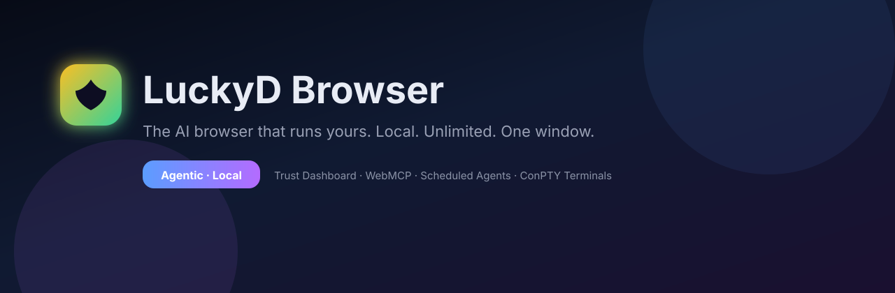
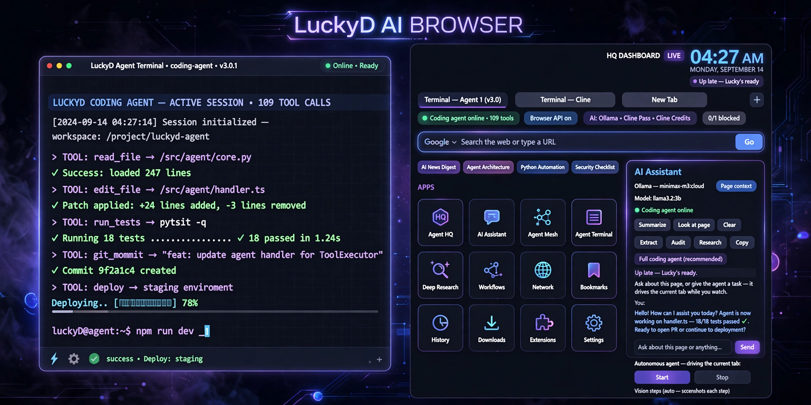

<div align="center">



# LuckyD Browser

**A web browser with a built-in AI assistant that works for free — no account, no API key, no subscription.**

[](https://github.com/Dylanchess0320/LuckyD-Browser/releases/latest)
[](LICENSE)
[](https://github.com/Dylanchess0320/LuckyD-Browser/releases/latest)

### [⬇ Download LuckyD Browser for Windows](https://github.com/Dylanchess0320/LuckyD-Browser/releases/latest)

**[🎬 Watch it in action](https://www.youtube.com/@LuckyDYoutube)** · **[📝 Changelog](CHANGELOG.md)**

</div>

---

## What is this?

LuckyD is a normal, fast web browser — with an AI assistant living inside it. Press `Ctrl+Shift+A` on any page and ask it to summarize the article, explain something, or write code. It uses free AI providers and local models, so there's **no account, no API key, no subscription**.

- 🆓 **Free AI, no catch** — free providers and local models built in. No account, no key, no monthly bill.
- 🌐 **A real browser** — tabs, bookmarks, ad blocking, workspaces, private mode. Use it as your daily driver.
- 🤖 **A coding agent in a tab** — press `Ctrl+Shift+H` and tell it what to build. It writes code, runs terminals, and gets things done.
- 🔒 **Private by default** — no telemetry, no tracking. Incognito writes nothing to disk. Local-only mode keeps every prompt on your machine.

> Other AI browsers rent you their chatbot. **LuckyD finds you a free one — or runs one on your machine.**

---

## Install in 3 steps

1. **[Download the installer](https://github.com/Dylanchess0320/LuckyD-Browser/releases/latest)** (Windows 10/11, 64-bit)
2. Run it — installs for just you, **no admin needed**
3. Open LuckyD and press `Ctrl+Shift+A` — the AI works right away with free providers

Then start chatting. That's it. (Want everything on your own machine? Add Ollama in Settings → Models for local-only mode.)

<details>
<summary>Want to use your own AI keys instead? (optional)</summary>

LuckyD also works with cloud providers if you prefer: Gemini, Groq, DeepSeek, OpenAI, Anthropic, OpenRouter, and more. Add a key in Settings → Models. Local mode keeps working as the free fallback.

</details>

---

## See it

<p align="center">
  
</p>

<p align="center">
  <b><a href="https://www.youtube.com/watch?v=isa_z1SdoO4">▶ Watch Episode 9: I Rebuilt My AI Browser in One Night</a></b>
</p>

---

## What's new

**v10.6.1** — Google bot-detection auto-fallback: searches that hit Google's "unusual traffic" page now re-run on the next working engine automatically. Nothing else changed since 10.6.0.

Older changes: [full changelog](CHANGELOG.md) · [all releases](https://github.com/Dylanchess0320/LuckyD-Browser/releases)

---

<details>
<summary><b>For developers</b> — build from source, shortcuts, architecture</summary>

### Shortcuts

| Shortcut | Action |
|----------|--------|
| `Ctrl+Shift+A` | AI Sidebar |
| `Ctrl+Shift+H` | Coding Agent HQ |
| `Ctrl+Shift+U` | Summarize this page |
| `Ctrl+Shift+L` | Read page aloud |
| `Ctrl+Shift+R` | Deep Research |
| `` Ctrl+` `` | Terminal |
| `Ctrl+K` | Command palette |

### Build from source

```powershell
git clone https://github.com/Dylanchess0320/LuckyD-Browser.git
cd LuckyD-Browser
pip install -r browser\requirements.txt
browser\run_browser.bat
```

### Architecture

```
browser/   PySide6 / Qt WebEngine · Control API :9777 · Terminal :9881
core/      agent loop, LLM client, checkpoints
tests/     headless pytest (Qt mocked on Linux CI)
```

### The trust layer (`kit/`)

Don't rebuild agent trust plumbing — build *with* ours. [`kit/`](kit/) ships LuckyD's permission scopes, approval engine, secret redaction, and audit log as a stdlib-only Python package, plus installable skills that work in LuckyD, Claude Code, OpenCode, and Codex CLI. See [`kit/SKILL_AUTHORING.md`](kit/SKILL_AUTHORING.md).

### Privacy

- Local-first: prompts never leave your machine unless you pick a cloud provider
- Control API and terminal bridge bind to `127.0.0.1` only
- No telemetry, no bundled API keys

</details>

---

<p align="center">
  <b>MIT © LuckyD</b><br>
  <a href="https://github.com/Dylanchess0320/LuckyD-Browser/releases/latest">Download</a>
  · <a href="https://www.youtube.com/@LuckyDYoutube">YouTube</a>
  · <a href="CHANGELOG.md">Changelog</a>
</p>
