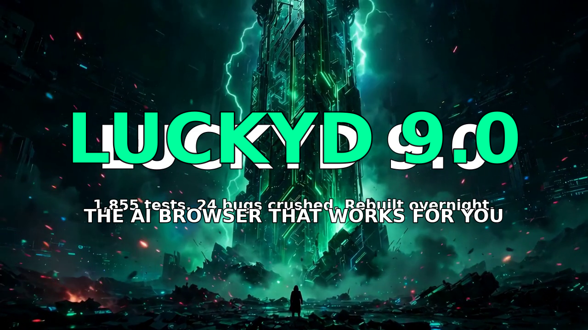
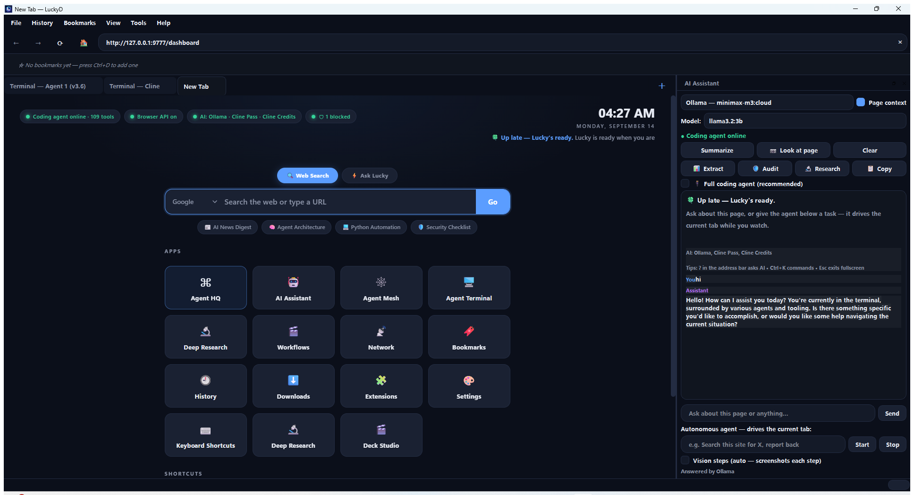

<div align="center">


# LuckyD Browser

**The AI browser that runs *your* models — local, unlimited, offline — plus a full coding agent and real terminals in one window.**

[](https://github.com/Dylanchess0320/LuckyD-Browser/actions/workflows/ci.yml)
[](https://github.com/Dylanchess0320/LuckyD-Browser/releases/latest)
[](https://github.com/Dylanchess0320/LuckyD-Browser/releases)
[](LICENSE)
[](https://github.com/Dylanchess0320/LuckyD-Browser/releases/latest)
[](https://www.python.org/downloads/)

**[⬇ Download Latest Release](https://github.com/Dylanchess0320/LuckyD-Browser/releases/latest)**
&nbsp;·&nbsp;
**[Browser guide](README-LuckyD-Browser.md)**
&nbsp;·&nbsp;
**[Changelog](CHANGELOG.md)**
&nbsp;·&nbsp;
**[YouTube](https://www.youtube.com/@LuckyDYoutube)**

</div>

## 🎬 Episode 9 is live — "I Rebuilt My AI Browser in One Night"

<p align="center">
  <a href="https://www.youtube.com/watch?v=isa_z1SdoO4">
    
  </a>
</p>

<p align="center">
  <b><a href="https://www.youtube.com/watch?v=isa_z1SdoO4">▶ Watch Episode 9 on YouTube</a></b> — 1,855 tests passing · 24 bugs crushed · rebuilt in a single night
</p>

<p align="center">
  
</p>

---

## Why LuckyD

Most “AI browsers” rent you a chatbot behind an account. LuckyD is a **real Chromium daily driver** with a **local assistant**, a **coding-agent HQ**, and **ConPTY terminals** living in your tabs.

| | LuckyD | Comet / Dia | Edge Copilot | Chrome Gemini |
|---|:---:|:---:|:---:|:---:|
| Free AI with **no account / no key** | ✅ local Ollama | ❌ | ❌ | ❌ |
| Works **fully offline** | ✅ | ❌ | ❌ | ❌ |
| Agent **drives your live tabs** | ✅ | ✅ | limited | limited |
| **Coding agent + terminals in tabs** | ✅ | ❌ | ❌ | ❌ |
| **Workspaces · HTTPS-Only · Memory Saver** | ✅ | mixed | mixed | mixed |
| Open source MIT · no admin to install | ✅ | ❌ | ❌ | ❌ |

> The others rent you their AI. **LuckyD runs yours.**

---

## Latest release

**v9.4.0** — Antigravity replaces Gemini in the Agent Mesh, on top of everything from 9.3.0:

| | |
|---|---|
| **⬇ Windows installer** | [`LuckyDBrowserSetup-9.4.0.exe`](https://github.com/Dylanchess0320/LuckyD-Browser/releases/download/v9.4.0/LuckyDBrowserSetup-9.4.0.exe) — built on a real Windows runner with Inno Setup 6. Per-user, no admin, silent-install flags. |
| **🛸 Antigravity (agy) mesh agent** | `agy` / `mesh-agy` shell covers the agent-mesh plan/build stages (Google DeepMind). Probed via PATH plus `%LOCALAPPDATA%\agy\bin` fallback. |
| **🧹 Gemini CLI removed** | `gemini` / `mesh-gemini` shells, dock chips, and fallback probing are gone — no more dead panes when Gemini isn't the plan/build driver. |
| **🖥 Cline CLI stays first-class** | `cline` shell alongside `mesh-cline` in both Agent 1 and Agent 2 terminals, with npm-fallback probing for frozen builds. |
| **📋 AI provider list** | `lucky-code providers`, `/providers` in the REPL, and `GET /api/providers` — all 13 providers with live status (ready / needs key), cost tier (free / paid), and the active provider marked. |
| **📡 Offline-proof model resolver** | The model catalog falls back to last-known-good models when the fetch fails instead of silently dropping to hardcoded defaults. |
| **💰 Honest cost tracking** | DeepSeek v4 at real rates; every free-tier route correctly reports $0. |
| **🔔 Quiet update badge** | A silent check runs at startup — when a new release exists, a small toolbar badge lights up. No modal, no interruption. |

<details>
<summary>New in 9.3.0 — AI provider list + reliability</summary>

9.1's look, with the good stuff from the messy days folded back in, plus a fixed installer:

| | |
|---|---|
| **📋 AI provider list** | `lucky-code providers`, `/providers` in the REPL, and `GET /api/providers` — all 13 providers with live status and cost tier. |
| **📡 Offline-proof model resolver** | The model catalog falls back to last-known-good models when the fetch fails. |
| **💰 Honest cost tracking** | DeepSeek v4 at real rates; every free-tier route correctly reports $0. |
| **🧩 Dashboard fix** | The Deep Research tile no longer renders twice. |
| **🔧 Installer fix** | The frozen app bundles pydantic/pydantic_core correctly — no more startup crash. |

</details>

<details>
<summary>New in 9.1.0 — Agent terminals upgrade</summary>

Gemini CLI and Cline CLI first-class in the agent terminals, and every free model in `/model`.

| | |
|---|---|
| **✨ Gemini CLI first-class** | `gemini` / `mesh-gemini` shells in both Agent 1 (v3.6) and Agent 2 (v2.2) terminals. |
| **🖥 Cline CLI first-class** | `cline` shell alongside `mesh-cline`. |
| **🆓 Every free model in /model** | Gemini free tier, Cline free tier (12 models), new ClinePass models (glm-5.3, glm-5.2, qwen3.8-max). |

</details>

<details>
<summary>New in 9.0.0 — Reliability release</summary>

Proxy-proof local AI, honest AI status, keyed OpenCode Zen, working DeepSeek Harness boot, focused Ctrl+K, readable shortcuts, and correct video color.

| | |
|---|---|
| **🔌 Proxy-proof local AI** | Ollama/LM Studio stay reachable with a proxy/VPN set — localhost never routes through the proxy, on the dashboard check and the chat path. |
| **🤖 Honest AI status** | The dashboard pill says exactly what's wrong: `Ollama not running`, `no models pulled`, or the working providers. |
| **🔑 OpenCode Zen keyed** | Zen's old keyless $0 tier is gone — it now registers with `OPENCODE_API_KEY` and serves its current platform catalog. |
| **🖥 DeepSeek Harness boots** | Agent Mesh spawns `dsh web` (the old `--profile web --no-open` invocation is no longer valid). |
| **⌨ Ctrl+K focus** | The command palette takes keyboard focus again, with Tab trap, fuzzy ranking, and Home/End nav. |
| **🔤 Readable shortcuts** | Home-page shortcut labels get brighter type with text shadow. |
| **🎨 Correct video color** | `--force-color-profile=srgb` on the software video path (was wrong BT.601 colorimetry). |

*Verified: 1,855 tests passed, coverage 81%, `ruff` clean.*

</details>

<details>
<summary>New in 8.0.0 — The Cleanup, phase one</summary>

Skills in the sidebar, smart routing, and a Neon Night home.

| | |
|---|---|
| **Contextual skill chips** | The 5 bundled skills (`ai-news-brief`, `chess`, `graphify`, `movie-picker`, `top-picks`) now surface as `✨` chips above the AI sidebar input as you type; one tap attaches the skill as chat context. |
| **Smart model routing** | `ModelRouter` is wired into `AIBridge.chat()` auto mode: it picks the provider per question (explicit picks always win; non-viable picks fall back to the existing chain). |
| **Neon Night home** | The real `/dashboard` and the `newtab.html` fallback share one refined typographic system: tabular clock, small-caps labels, system-only font stack, offline-safe, `prefers-reduced-motion` support. |
| **$0 OpenCode Zen fallback** | With no Ollama and no keys, chat falls back to the free Zen gateway instead of an empty-token provider. |
| **Honest provider labels** | Sidebar provider chips say `· free tier` / `· credit-billed ⚠`. |
| **Antigravity decluttered** | Redundant Tools-menu and command-palette launchers removed; it's already in the terminal. |
| **Copy freshness** | README, docs, `.github`, and in-app text brought current; About dialog and window titles now say "LuckyD". |

*Verified: 465 tests passed, `ruff` clean.*

</details>

<details>
<summary>New in 7.0.0 — Lucky polish</summary>

Lucky polish — slim chrome, corrected colors, soul — on top of everything in 6.0.0.

</details>

<details>
<summary>New in 6.0.0 — Trust foundation</summary>

Agentic with receipts: permission scopes, risk levels, secret redaction, an append-only audit log, and an approval queue at `/trust` — plus WebMCP, scheduled/background agents, and the open Skills marketplace.

| | |
|---|---|
| **🛡 Trust dashboard** | "Agentic with receipts": permission scopes, risk levels, secret redaction, an append-only audit log, and an approval queue — review everything the agents did at `/trust`. |
| **🔒 Trust hardening** | Legacy `auto_approve_all` bypasses removed (now inert with a warning); explicit audited `auto_approve_low_risk` per-run mode; cross-process run locks so scheduled and interactive runs can't collide; mutating schedule-dashboard routes gated by approval; zero-valued schedule fields (`max_retries=0`) honored instead of dropped. |
| **🔌 WebMCP** | Websites can expose typed agent tools to LuckyD (JS shim + native support), permission-gated so sites can't reach beyond their grant. Server-side schema validation, 30s dispatch timeouts, and origin binding via rotating discovery tokens — a page can't call tools on another origin's behalf, and bindings are keyed per tab. |
| **⏰ Scheduled agents** | Background agents on cron schedules with a **morning digest** (`/schedules`) — it works while you rest. |
| **🧩 Skills marketplace** | Open skill registries with hash-verified install, update, remove, and publish for agent skills. |
| **🛡 Agent circuit breaker** | The agent loop stops after 4 consecutive all-tool-failure turns with an actionable message instead of burning turns and budget. |

*Verified: 428 tests passed, `ruff` clean.*

</details>

<details>
<summary>New in 5.0.0 — Final</summary>

The maxed-out release: everything from 4.0, shipped like a finished product.

| | |
|---|---|
| **Official Windows installer** | `LuckyDBrowserSetup-5.0.0.exe` — built on a real Windows runner with Inno Setup 6. Per-user, no admin, silent-install flags. |
| **Version unified** | 5.0.0 everywhere — package, installers, user-agent — guarded by a regression test so it can't drift. |
| **Fully formatted & linted** | Entire tree `ruff`-clean, CI green. |

*Verified: 365 tests passed, `ruff` clean.*

</details>

<details>
<summary>New in 4.0.0 — Frontier</summary>

A hardened foundation: every local service now authenticates with HttpOnly session cookies — no tokens in URLs or page source, ever.

| | |
|---|---|
| **Cookie-based auth** | Control API, Coding Agent HQ, and terminal WebSocket use `luckyd_ctl` / `luckyd_hq` / `luckyd_term` session cookies. Zero credentials embedded in served HTML. |
| **Deep Research XSS hardening** | Report markdown is HTML-escaped before rendering; links allowlisted to `http:`, `https:`, `mailto:` with `rel="noopener"`. |
| **Cline bridge auth** | `/v1/models` and `/v1/chat/completions` require a bearer token (`CLINE_BRIDGE_TOKEN`); fails closed when unconfigured. |
| **SSRF protection** | Agent web tools validate DNS against private/loopback/metadata IPs, re-check redirects, pin connections to validated IPs (anti DNS-rebinding), ignore env proxies. |
| **Single command blocklist** | One consolidated blocklist gates every shell in the system — agent Bash tool and background processes alike. |
| **Reliability fixes** | Checkpoint undo can't loop forever on deleted files; IPv6 loopback (`[::1]`) handled; Windows updater exits cleanly off-Windows; race-safe terminal server; session saves survive concurrent windows; tile processes reaped on shutdown. |

*Verified: 189 tests passed, `ruff` clean.*

</details>

<details>
<summary>New in 3.9.0 — Daily Driver</summary>

A browser you can actually live in, not just demo.

| | |
|---|---|
| **HTTPS-Only Mode** | Public `http://` navigations upgrade to `https://`. Localhost and private LAN addresses are never rewritten. |
| **Site permissions** | Camera, mic, location, notifications, pointer lock, and screen capture prompt **once** and remember Allow/Block. Click the lock icon. Incognito never persists. |
| **Workspaces** | Named tab collections — File → Workspaces, or the command palette (`Ctrl+K`). Switching saves the current window first. |
| **Memory Saver** | Idle background tabs freeze at 5 minutes and discard at 15. Pinned, audible, and local HQ/terminal tabs stay awake. Sleeping tabs show 💤. |
| **Read Aloud** | `Ctrl+Shift+L` or toolbar 🔊 — speaks the selection or the page via Windows SAPI. Click again to stop. |
| **Summarize this page** | `Ctrl+Shift+U` or toolbar ✨ — opens the AI sidebar and summarizes the current tab. |

Also in this lineage: Deep Research swarm (`Ctrl+Shift+R`), Agent Mesh, self-healing workflows, and one-click in-app updates.
</details>

---

## The one-window platform

| Surface | What it is | Open it |
|---|---|---|
| **AI Sidebar** | Chat-first: Markdown chat, contextual skill chips, honest cost labels per model (`· free tier`, `· credit-billed ⚠`), visual Q&A, autonomous agent on your **real visible tab** | `Ctrl+Shift+A` |
| **Coding Agent HQ** | Full `luckyd-code` workspace in a tab — 70+ tools, memory, sessions | `Ctrl+Shift+H` |
| **Terminals** | Real Windows ConPTY via xterm.js — agent CLI, PowerShell, CMD, Agent Mesh | `` Ctrl+` `` |
| **Dashboard** | Live new-tab hub: status pills, Ask LuckyD, one-tap tiles, speed dial | New tab |
| **Workflows** | Record Control-API actions, replay with self-healing element matching | Tools → Workflows |

**Harness mode is on by default:** sidebar tasks run on the coding-agent backend, which can drive the tabs you are looking at.

---

## Install in 10 seconds

1. Get **[LuckyDBrowserSetup-9.4.0.exe](https://github.com/Dylanchess0320/LuckyD-Browser/releases/download/v9.4.0/LuckyDBrowserSetup-9.4.0.exe)**
2. Run it — per-user, **no admin**, installs to `%LOCALAPPDATA%\Programs\LuckyDBrowser`
3. Leave **“Set up free unlimited local AI”** checked → Ollama + `llama3.2:3b` (~2 GB, one time)
4. `Ctrl+Shift+A` → chat offline. Or bring your own keys (Gemini, Groq, DeepSeek, OpenAI, Anthropic, Z.ai, OpenRouter, Cline, OpenCode)

No local model yet? With no Ollama and no keys, chat falls back to the OpenCode Zen gateway (`OPENCODE_API_KEY`) — no local server needed.

Silent: `LuckyDBrowserSetup-9.4.0.exe /VERYSILENT /NORESTART`

Windows 10/11 x64 only.

---

## Keyboard

| Shortcut | Action |
|----------|--------|
| `Ctrl+Shift+A` | AI Sidebar |
| `Ctrl+Shift+H` | Coding Agent HQ |
| `Ctrl+Shift+U` | Summarize this page |
| `Ctrl+Shift+L` | Read Aloud |
| `Ctrl+Shift+R` | Deep Research |
| `` Ctrl+` `` / `Ctrl+Shift+`` ` | Terminal (Agent / PowerShell) |
| `Ctrl+Alt+M` | Agent Mesh (4 panes) |
| `Ctrl+K` | Command palette |
| `Ctrl+Alt+R` / `Ctrl+Shift+F` | Reader / Focus |
| `Ctrl+,` | Settings |

---

## Privacy

- Local-first Ollama — prompts never leave the machine unless you pick a cloud provider
- Control API and terminal bridge bind **127.0.0.1 only**, with per-profile tokens
- No telemetry, no bundled API keys, incognito writes nothing to disk

---

## Build from source

```powershell
git clone https://github.com/Dylanchess0320/LuckyD-Browser.git
cd LuckyD-Browser
pip install -r browser\requirements.txt
browser\run_browser.bat

# Shareable installer (needs Inno Setup 6)
powershell -NoProfile -ExecutionPolicy Bypass -File browser\installer\build_installer.ps1
# → browser\installer\output\LuckyDBrowserSetup-9.4.0.exe
```

---

## Structure

```
browser/   PySide6 / Qt WebEngine · Control API :9777 · Terminal :9881
core/      agent loop, LLM client, checkpoints
tools/     70+ tools including orchestration and Deep Research
tests/     headless pytest (Qt mocked on Linux CI)
```

---

<p align="center">
  <b>MIT © LuckyD</b> · Chromium · Ollama · Qt · xterm.js · pywinpty · PyInstaller · Inno Setup<br>
  <a href="https://github.com/Dylanchess0320/LuckyD-Browser/releases/latest">Download Latest Release</a>
  · <a href="https://www.youtube.com/watch?v=La6bxaa7icY">Watch the showcase</a>
</p>

